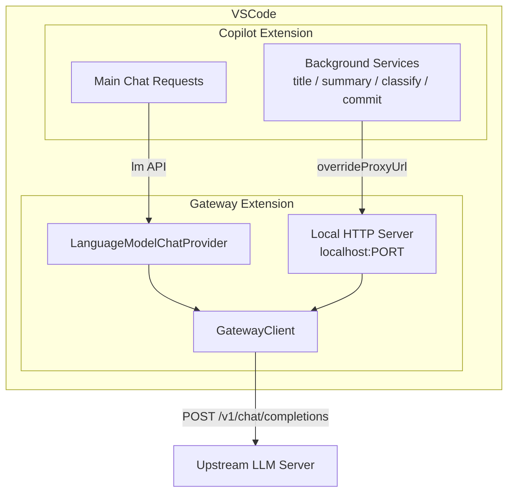

# Copilot Proxy Server — Implementation Plan

## Problem Summary

Copilot's background services (title generation, summarization, intent classification, commit messages, etc.) use `getChatEndpoint('copilot-fast')` which bypasses the VS Code `LanguageModelChat` API entirely. These requests go directly to `api.githubcopilot.com` via Copilot's internal HTTP client — the Gateway extension's `LanguageModelChatProvider` never sees them. When Copilot quota is exhausted, all these services fail.

## Solution: Local HTTP Proxy Server

The Gateway extension starts a local HTTP server at activation time. Setting `github.copilot.advanced.debug.overrideProxyUrl` to `http://localhost:<port>` redirects Copilot's internal HTTP requests to this server, which forwards them to the upstream LLM via the existing `GatewayClient`.



---

## Architecture Decisions

### 1. New Module: `src/copilotProxyServer.ts`

A self-contained module with **no direct VS Code API dependency** (except for logging), making it unit-testable. The module:

- Creates an `http.Server` listening on `localhost:0` (auto-assigned port)
- Handles `POST /chat/completions` and optionally `GET /models`
- Maps model names via a configurable mapping table
- Creates a **separate** `GatewayClient` instance (reusing the same `GatewayConfig`) to forward requests
- Returns SSE streaming responses in OpenAI format

### 2. Why a Separate GatewayClient Instance?

The existing [`GatewayClient.streamChatCompletion()`](src/client.ts:304) requires a `vscode.CancellationToken`. The HTTP server path doesn't have one from VS Code — it needs to create its own `AbortController`-based cancellation tied to the HTTP request lifecycle. Using a separate client instance avoids coupling the two code paths. The client already accepts `GatewayConfig` in its constructor and has `updateConfig()` — the proxy server can share the same config object.

### 3. Model Mapping Strategy

Copilot sends model names like `gpt-4o-mini` and `gpt-4.1-2025-04-14`. The proxy needs a user-configurable mapping to upstream model names. This mapping is stored in VS Code settings under `llm-gateway.copilotProxy.modelMapping`.

### 4. Integration Point: `src/extension.ts`

The proxy server lifecycle is managed in [`activate()`](src/extension.ts:195) / [`deactivate()`](src/extension.ts:415):
- Start the server after the provider is initialized
- Register the server as a disposable in `context.subscriptions`
- Optionally auto-configure `overrideProxyUrl`

---

## File Changes

### New Files

| File | Purpose |
|------|---------|
| `src/copilotProxyServer.ts` | HTTP server, request handler, model mapping, SSE response writer |
| `src/__tests__/copilotProxyServer.test.ts` | Unit tests for the proxy server |

### Modified Files

| File | Changes |
|------|---------|
| `src/extension.ts` | Start/stop proxy server in activate/deactivate lifecycle |
| `src/client.ts` | Extract an overload or helper so streaming works without `vscode.CancellationToken` |
| `src/types.ts` | Add `CopilotProxyConfig` interface |
| `package.json` | Add new configuration properties for the proxy |

---

## Detailed Implementation Steps

### Step 1: Add Configuration Schema to `package.json`

Add these new settings under `contributes.configuration.properties`:

```jsonc
{
  "github.copilot.llm-gateway.copilotProxy.enabled": {
    "type": "boolean",
    "default": false,
    "description": "Enable the local Copilot proxy server to intercept background service requests"
  },
  "github.copilot.llm-gateway.copilotProxy.modelMapping": {
    "type": "object",
    "default": {
      "gpt-4o-mini": "",
      "gpt-4.1-2025-04-14": ""
    },
    "additionalProperties": { "type": "string" },
    "description": "Map Copilot model names to upstream model names. Empty values use the first available model."
  },
  "github.copilot.llm-gateway.copilotProxy.autoConfigureOverrideUrl": {
    "type": "boolean",
    "default": true,
    "description": "Automatically set github.copilot.advanced.debug.overrideProxyUrl when the proxy starts"
  }
}
```

Add a new command:

```jsonc
{
  "command": "github.copilot.llm-gateway.toggleCopilotProxy",
  "title": "Toggle Copilot Proxy",
  "category": "GitHub Copilot LLM Gateway"
}
```

### Step 2: Add Types to `src/types.ts`

```typescript
export interface CopilotProxyConfig {
  enabled: boolean;
  modelMapping: Record<string, string>;
  autoConfigureOverrideUrl: boolean;
}
```

### Step 3: Refactor `GatewayClient` to Support Proxy Usage — `src/client.ts`

The current [`streamChatCompletion()`](src/client.ts:304) signature requires `vscode.CancellationToken`. The proxy server needs to stream without one. Two options:

**Option A (recommended):** Add an overload that accepts a plain `AbortSignal`:

```typescript
public async *streamChatCompletion(
  request: OpenAIChatCompletionRequest,
  cancellation: vscode.CancellationToken | AbortSignal
): AsyncGenerator<GatewayStreamChunk, void, unknown>
```

The internal `createStreamTimers` already works with `AbortController` — just adapt the cancellation subscription based on input type.

**Option B:** Keep the existing method unchanged. The proxy server builds its own `fetch` + SSE parsing loop using the same URL/headers from `GatewayConfig`. This duplicates some code but is fully decoupled.

**Recommendation:** Option A — minimal code change, maximum reuse.

### Step 4: Create `src/copilotProxyServer.ts`

This is the main new module. Structure:

```typescript
// Public API
export class CopilotProxyServer implements Disposable {
  constructor(config: GatewayConfig, proxyConfig: CopilotProxyConfig, logger: Logger);
  
  start(): Promise<number>;        // returns assigned port
  stop(): Promise<void>;
  updateConfig(config: GatewayConfig, proxyConfig: CopilotProxyConfig): void;
  
  get port(): number | undefined;
  get isRunning(): boolean;
  
  dispose(): void;
}
```

Internal structure:

1. **`handleRequest(req, res)`** — routes incoming HTTP requests
2. **`handleChatCompletions(req, res)`** — the core handler:
   - Parse JSON body from `IncomingMessage`
   - Ignore `Authorization` header (Copilot JWT is meaningless)
   - Map `body.model` using the model mapping table
   - Create `AbortController` tied to `req.on('close')`
   - Forward via `GatewayClient.streamChatCompletion()`
   - Write SSE response chunks: `data: {...}\n\n`
   - End with `data: [DONE]\n\n`
3. **`handleModels(req, res)`** — optional, returns available models
4. **`mapModel(requestedModel)`** — apply model mapping with fallback
5. **`writeSSEChunk(res, chunk)`** — format a `GatewayStreamChunk` as an OpenAI SSE line

Key implementation details:

- **Body parsing**: Buffer `req.on('data')` chunks, parse JSON on `req.on('end')`
- **Error handling**: Return proper HTTP error codes (400, 500) with JSON error bodies matching OpenAI error format
- **Request cancellation**: When the client disconnects (`req.on('close')`), abort the upstream request
- **SSE format**: Each chunk must include `id`, `object`, `model`, `choices` to match what Copilot expects
- **Non-streaming fallback**: Some Copilot requests may set `stream: false` — accumulate the full response and return as a single JSON object

### Step 5: Wire Into Extension Lifecycle — `src/extension.ts`

In [`activate()`](src/extension.ts:195):

```typescript
// After provider initialization
const proxyConfig = loadProxyConfig();
if (proxyConfig.enabled) {
  const proxyServer = new CopilotProxyServer(
    provider.getConfig(),  // need to expose this
    proxyConfig,
    (msg) => outputChannel.appendLine(`[Proxy] ${msg}`)
  );
  const port = await proxyServer.start();
  context.subscriptions.push(proxyServer);
  
  if (proxyConfig.autoConfigureOverrideUrl) {
    await vscode.workspace.getConfiguration('github.copilot').update(
      'advanced.debug.overrideProxyUrl',
      `http://localhost:${port}`,
      vscode.ConfigurationTarget.Global
    );
  }
  
  outputChannel.appendLine(`Copilot proxy server started on port ${port}`);
}
```

In [`deactivate()`](src/extension.ts:415), the dispose pattern handles cleanup automatically via `context.subscriptions`.

Additionally:
- Expose `provider.getConfig()` or pass the config directly
- Listen for config changes on `copilotProxy.*` keys to restart the server if needed
- Add the proxy server status to the status bar tooltip

### Step 6: SSE Response Formatting

The proxy must convert `GatewayStreamChunk` back to OpenAI wire format. Each chunk from the upstream looks like:

```typescript
interface GatewayStreamChunk {
  content: string;
  reasoning_content: string;
  tool_calls: AccumulatedToolCall[];
  finished_tool_calls: AccumulatedToolCall[];
  usage?: OpenAIUsage;
}
```

The proxy must write:

```
data: {"id":"chatcmpl-proxy-xxx","object":"chat.completion.chunk","created":1234567890,"model":"mapped-model","choices":[{"index":0,"delta":{"content":"Hello"},"finish_reason":null}]}

data: [DONE]
```

For tool calls in `finished_tool_calls`, emit:

```
data: {"id":"...","object":"chat.completion.chunk","model":"...","choices":[{"index":0,"delta":{"tool_calls":[{"id":"tc_xxx","type":"function","function":{"name":"foo","arguments":"{...}"}}]},"finish_reason":"tool_calls"}]}
```

### Step 7: Write Unit Tests — `src/__tests__/copilotProxyServer.test.ts`

Tests should cover:

1. **Model mapping** — known model → mapped model, unknown model → fallback
2. **Request parsing** — valid body, invalid JSON, missing model field
3. **SSE response format** — correct `data:` lines, correct `[DONE]` terminator
4. **Server lifecycle** — start/stop/restart, port assignment
5. **Error handling** — upstream errors forwarded as HTTP 502
6. **Request cancellation** — client disconnect aborts upstream

### Step 8: Status Bar Integration

Add proxy server status to the tooltip rendered by [`renderStatusTooltipHtml()`](src/statusTooltip.ts). Show:
- Whether the proxy is running
- Which port it's on
- The configured model mapping

Add proxy state to [`StatusSnapshot`](src/statusSnapshot.ts) interface.

---

## Configuration Summary

Final user-facing configuration:

```jsonc
{
  // Existing settings
  "github.copilot.llm-gateway.serverUrl": "http://your-upstream:8080",
  
  // New: Copilot Proxy settings
  "github.copilot.llm-gateway.copilotProxy.enabled": true,
  "github.copilot.llm-gateway.copilotProxy.modelMapping": {
    "gpt-4o-mini": "qwen2.5-7b-instruct",
    "gpt-4.1-2025-04-14": "qwen2.5-72b-instruct"
  },
  "github.copilot.llm-gateway.copilotProxy.autoConfigureOverrideUrl": true,
  
  // Auto-managed by the proxy (or manually set)
  "github.copilot.advanced.debug.overrideProxyUrl": "http://localhost:<auto>"
}
```

---

## Verification Checklist

- [ ] Proxy server starts when `copilotProxy.enabled` is `true`
- [ ] HTTP server accepts `POST /chat/completions`
- [ ] Copilot `Authorization` header is ignored
- [ ] Model name mapping works correctly (gpt-4o-mini → upstream model)
- [ ] Requests are forwarded via `GatewayClient` to upstream
- [ ] SSE streaming response format is correct
- [ ] Tool calls in requests are passed through
- [ ] `overrideProxyUrl` is auto-configured when enabled
- [ ] Copilot title generation works through proxy
- [ ] Copilot conversation summary works through proxy
- [ ] Server shuts down cleanly on extension deactivate
- [ ] Config changes restart the server with new settings
- [ ] Status bar shows proxy status
- [ ] Non-streaming requests are handled correctly
