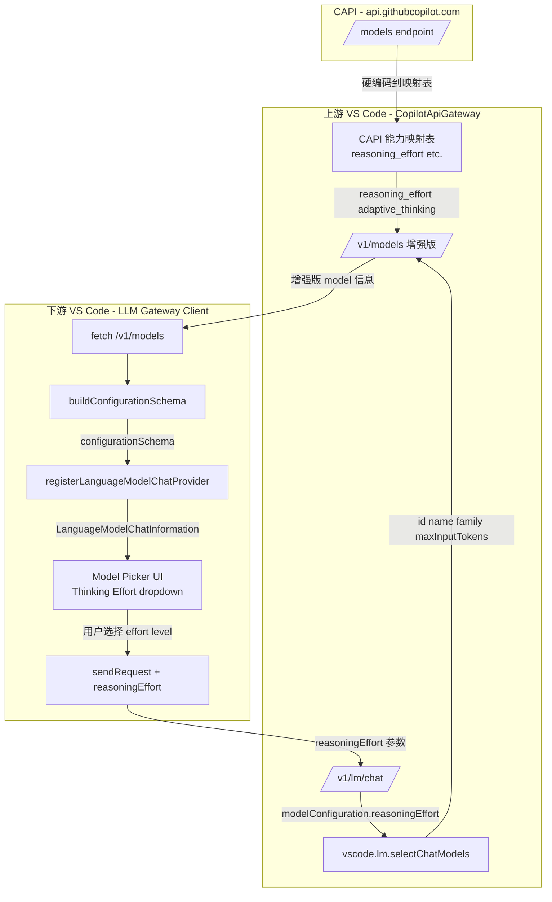

# 自定义构造 Model configurationSchema 方案

## 问题概述

上游 `CopilotApiGateway` 通过 `vscode.lm.selectChatModels()` 获取模型信息并通过 `/v1/models` 暴露给下游。但 `selectChatModels()` 返回的 `LanguageModelChat` 对象**不包含**：
- `configurationSchema`（Thinking Effort picker）
- `model_picker_category` / `model_picker_enabled`
- `reasoning_effort` 支持列表
- `adaptive_thinking` / `thinking_budget` 配置

导致下游 Client 注册的模型在 Copilot 会话中**没有** Thinking Effort 和 Context Size 选项。

## 数据来源分析

### CAPI `/models` 返回的关键字段

从 CAPI 原始数据中提取的能力矩阵：

| 模型 | reasoning_effort | adaptive_thinking | thinking_budget | context_window |
|------|-----------------|-------------------|-----------------|----------------|
| claude-opus-4.6-1m | low,medium,high,max | ✅ | 1024-32000 | 1,000,000 |
| claude-opus-4.6 | low,medium,high,max | ✅ | 1024-32000 | 1,000,000 |
| claude-opus-4.7-1m-internal | low,medium,high,xhigh,max | ✅ | 1024-32000 | 1,000,000 |
| claude-opus-4.7 | low,medium,high,xhigh,max | ✅ | 1024-32000 | 1,000,000 |
| claude-opus-4.8 | low,medium,high,xhigh,max | ✅ | 1024-32000 | 1,000,000 |
| claude-sonnet-4.6 | low,medium,high,max | ✅ | 1024-32000 | 1,000,000 |
| claude-sonnet-4.5 | ❌ | ❌ | 1024-32000 | 200,000 |
| claude-opus-4.5 | ❌ | ❌ | 1024-32000 | 200,000 |
| claude-haiku-4.5 | ❌ | ❌ | 1024-32000 | 200,000 |
| gemini-3.1-pro-preview | low,medium,high | ❌ | 256-32000 | 1,000,000 |
| gemini-3.5-flash | minimal,low,medium,high | ❌ | 256-24000 | 1,000,000 |
| gemini-3-flash-preview | low,medium,high | ❌ | 256-32000 | 128,000 |
| gemini-2.5-pro | ❌ | ❌ | 128-32768 | 128,000 |
| gpt-5.3-codex | low,medium,high,xhigh | ❌ | ❌ | 400,000 |
| gpt-5.4-mini | none,low,medium,high,xhigh | ❌ | ❌ | 400,000 |
| gpt-5.4 | none,low,medium,high,xhigh | ❌ | ❌ | 1,050,000 |
| gpt-5.5 | none,low,medium,high,xhigh | ❌ | ❌ | 1,050,000 |
| gpt-5-mini | low,medium,high | ❌ | ❌ | 264,000 |
| mai-code-1-flash | low,medium,high | ❌ | ❌ | 256,000 |

### Copilot Chat 如何消费这些字段

```
CAPI /models
  → capabilities.supports.reasoning_effort  →  buildConfigurationSchema()  →  configurationSchema.properties.reasoningEffort
  → capabilities.supports.adaptive_thinking →  ChatEndpoint.supportsAdaptiveThinking
  → capabilities.supports.vision            →  capabilities.imageInput
  → capabilities.supports.tool_calls        →  capabilities.toolCalling
  → capabilities.limits.max_prompt_tokens   →  maxInputTokens
  → model_picker_enabled                    →  isUserSelectable
  → model_picker_category                   →  category
```

## 方案设计

### 第一步：上游 Gateway 扩展 `/v1/models` 响应

在上游 `CopilotApiGateway.getAvailableModels()` 中，除了从 `selectChatModels()` 获取基础信息外，**硬编码一份 CAPI 能力映射表**：

```typescript
// 基于 CAPI 原始数据构建的静态能力映射
const CAPI_MODEL_CAPABILITIES: Record<string, {
  reasoning_effort?: string[];
  adaptive_thinking?: boolean;
  min_thinking_budget?: number;
  max_thinking_budget?: number;
  model_picker_category?: string;
  model_picker_price_category?: string;
}> = {
  'claude-opus-4.6-1m':       { reasoning_effort: ['low','medium','high','max'], adaptive_thinking: true, min_thinking_budget: 1024, max_thinking_budget: 32000, model_picker_category: 'powerful', model_picker_price_category: 'high' },
  'claude-opus-4.6':          { reasoning_effort: ['low','medium','high','max'], adaptive_thinking: true, min_thinking_budget: 1024, max_thinking_budget: 32000, model_picker_category: 'powerful', model_picker_price_category: 'high' },
  'claude-opus-4.7-1m-internal': { reasoning_effort: ['low','medium','high','xhigh','max'], adaptive_thinking: true, min_thinking_budget: 1024, max_thinking_budget: 32000, model_picker_category: 'powerful', model_picker_price_category: 'high' },
  'claude-opus-4.7':          { reasoning_effort: ['low','medium','high','xhigh','max'], adaptive_thinking: true, min_thinking_budget: 1024, max_thinking_budget: 32000, model_picker_category: 'powerful', model_picker_price_category: 'high' },
  'claude-opus-4.8':          { reasoning_effort: ['low','medium','high','xhigh','max'], adaptive_thinking: true, min_thinking_budget: 1024, max_thinking_budget: 32000, model_picker_category: 'powerful', model_picker_price_category: 'high' },
  'claude-sonnet-4.6':        { reasoning_effort: ['low','medium','high','max'], adaptive_thinking: true, min_thinking_budget: 1024, max_thinking_budget: 32000, model_picker_category: 'versatile', model_picker_price_category: 'medium' },
  'gemini-3.1-pro-preview':   { reasoning_effort: ['low','medium','high'], model_picker_category: 'powerful', model_picker_price_category: 'medium' },
  'gemini-3.5-flash':         { reasoning_effort: ['minimal','low','medium','high'], model_picker_category: 'lightweight', model_picker_price_category: 'medium' },
  'gpt-5.3-codex':            { reasoning_effort: ['low','medium','high','xhigh'], model_picker_category: 'powerful', model_picker_price_category: 'medium' },
  'gpt-5.4-mini':             { reasoning_effort: ['none','low','medium','high','xhigh'], model_picker_category: 'lightweight', model_picker_price_category: 'low' },
  'gpt-5.4':                  { reasoning_effort: ['none','low','medium','high','xhigh'], model_picker_category: 'powerful', model_picker_price_category: 'medium' },
  'gpt-5.5':                  { reasoning_effort: ['none','low','medium','high','xhigh'], model_picker_category: 'powerful', model_picker_price_category: 'high' },
  'gpt-5-mini':               { reasoning_effort: ['low','medium','high'], model_picker_category: 'lightweight', model_picker_price_category: 'low' },
  'mai-code-1-flash-internal': { reasoning_effort: ['low','medium','high'], model_picker_category: 'versatile', model_picker_price_category: 'low' },
  'gemini-3-flash-preview':   { reasoning_effort: ['low','medium','high'], model_picker_category: 'lightweight', model_picker_price_category: 'low' },
};
```

修改 `getAvailableModels()` 的返回格式：

```typescript
private async getAvailableModels() {
  const allModels = this.filterLoopbackModels(await vscode.lm.selectChatModels());
  return allModels.map(model => {
    const capiCaps = CAPI_MODEL_CAPABILITIES[model.id] ?? inferCapabilities(model);
    return {
      // 现有字段
      id: model.id,
      object: 'model',
      name: model.name,
      family: model.family,
      version: model.version,
      max_input_tokens: model.maxInputTokens,
      // 扩展字段 — 从 CAPI 映射表补充
      capabilities: {
        chat_completion: true,
        streaming: true,
        token_counting: true,
        tool_calling: true,
        image_input: model.capabilities?.supportsImageToText ?? false,
        // 新增
        reasoning_effort: capiCaps?.reasoning_effort,
        adaptive_thinking: capiCaps?.adaptive_thinking,
        min_thinking_budget: capiCaps?.min_thinking_budget,
        max_thinking_budget: capiCaps?.max_thinking_budget,
      },
      model_picker_category: capiCaps?.model_picker_category,
      model_picker_price_category: capiCaps?.model_picker_price_category,
    };
  });
}
```

### 第二步：下游 Client 构建 configurationSchema

下游 Client 收到扩展后的 `/v1/models` 响应时，在注册模型时构建 `configurationSchema`：

```typescript
function buildConfigurationSchema(
  modelId: string,
  family: string,
  capabilities: { reasoning_effort?: string[] }
): vscode.LanguageModelConfigurationSchema | undefined {
  const effortLevels = capabilities.reasoning_effort;
  if (!effortLevels || effortLevels.length === 0) return undefined;

  // Claude 默认 high, GPT 默认 medium
  const lowerFamily = family.toLowerCase();
  const preferred = lowerFamily.startsWith('claude') ? 'high' : 'medium';
  const defaultEffort = effortLevels.includes(preferred) ? preferred : undefined;

  return {
    properties: {
      reasoningEffort: {
        type: 'string',
        title: 'Thinking Effort',
        enum: effortLevels,
        enumItemLabels: effortLevels.map(l => l.charAt(0).toUpperCase() + l.slice(1)),
        enumDescriptions: effortLevels.map(level => {
          switch (level) {
            case 'none': return 'No reasoning applied';
            case 'minimal': return 'Minimal reasoning for fastest responses';
            case 'low': return 'Faster responses with less reasoning';
            case 'medium': return 'Balanced reasoning and speed';
            case 'high': return 'Greater reasoning depth but slower';
            case 'xhigh': return 'Maximum reasoning depth but slower';
            case 'max': return 'Absolute maximum capability';
            default: return level;
          }
        }),
        default: defaultEffort,
        group: 'navigation',  // 显示在模型 picker 主导航区
      }
    }
  };
}
```

### 第三步：注册模型时附上 configurationSchema

```typescript
const model: vscode.LanguageModelChatInformation = {
  id: remoteModel.id,
  name: remoteModel.name,
  family: remoteModel.family,
  version: remoteModel.version,
  maxInputTokens: remoteModel.max_input_tokens,
  maxOutputTokens: remoteModel.max_output_tokens,
  isUserSelectable: true,
  capabilities: {
    imageInput: remoteModel.capabilities?.image_input ?? false,
    toolCalling: remoteModel.capabilities?.tool_calling ?? true,
  },
  // 关键：构建 configurationSchema
  configurationSchema: buildConfigurationSchema(
    remoteModel.id,
    remoteModel.family,
    remoteModel.capabilities
  ),
};
```

### 第四步：处理 reasoningEffort 请求参数

当用户在 UI 中选择 Thinking Effort 后，VS Code 会在 `sendRequest` 的 options 中传入 `modelConfiguration.reasoningEffort`。下游 Client 需要将此参数透传给上游：

```typescript
// 在 provideLanguageModelChatResponse 中
async provideLanguageModelChatResponse(
  model: vscode.LanguageModelChatInformation,
  messages: vscode.LanguageModelChatMessage[],
  options: vscode.ProvideLanguageModelChatResponseOptions,
  progress: vscode.Progress<vscode.LanguageModelResponsePart>,
  token: vscode.CancellationToken
): Promise<void> {
  const reasoningEffort = options.modelConfiguration?.reasoningEffort;

  // 将 reasoningEffort 传给上游 /v1/lm/chat
  const body = {
    model: model.id,
    messages: serializeMessages(messages),
    tools: serializeTools(options.tools),
    // 新增：透传 reasoning effort
    reasoningEffort,
  };

  await streamLmPassthrough(upstreamUrl, body, progress, token);
}
```

上游 Gateway 在 `processLmChat()` 中读取并传给 Copilot：

```typescript
// CopilotApiGateway.processLmChat()
const reasoningEffort = payload?.reasoningEffort;

const options: vscode.LanguageModelChatRequestOptions = {
  tools,
  // 透传 reasoningEffort 到 modelConfiguration
  modelConfiguration: reasoningEffort ? { reasoningEffort } : undefined,
};

const response = await lmModel.sendRequest(messages, options, cts.token);
```

## 架构流程图



## 实施步骤总结

1. **上游 Gateway**：在 `CopilotApiGateway` 中添加 `CAPI_MODEL_CAPABILITIES` 静态映射表，修改 `getAvailableModels()` 在 `/v1/models` 响应中包含 `reasoning_effort` 等扩展字段
2. **上游 Gateway**：在 `processLmChat()` 中读取请求体的 `reasoningEffort` 参数，透传到 `sendRequest()` 的 `modelConfiguration`
3. **下游 Client**：收到 `/v1/models` 时，基于 `capabilities.reasoning_effort` 构建 `configurationSchema`
4. **下游 Client**：在 `registerLanguageModelChatProvider` 时附上 `configurationSchema`
5. **下游 Client**：在 `provideLanguageModelChatResponse` 中读取 `options.modelConfiguration.reasoningEffort` 并透传给上游 `/v1/lm/chat`

## 注意事项

- 静态映射表需要随 CAPI 模型更新而手动维护。可考虑后续增加一个 `/v1/models/capabilities` 端点自动刷新
- `configurationSchema` 的 `group: 'navigation'` 是关键——它让选项显示在模型 picker 的主导航区而非设置页面
- Context size 选项是 VS Code 核心对同 family 不同 context window 模型的自动分组——只要注册了 `claude-opus-4.6` 和 `claude-opus-4.6-1m` 两个模型，VS Code 会自动显示 200k/1M 切换
