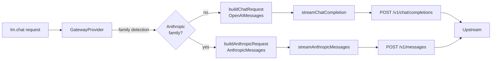

# Native Anthropic Messages API for Claude Models — Implementation Plan

## Problem Summary

The Gateway's `LanguageModelChatProvider` path ([`provider.ts`](../src/provider.ts) → [`GatewayClient.streamChatCompletion()`](../src/client.ts)) sends **every** request — including ones aimed at Claude models — to the upstream's OpenAI-compatible `/v1/chat/completions` endpoint ([`client.ts:308`](../src/client.ts:308) hard-codes the URL). When a user configures an upstream that fronts Anthropic (Vertex AI Claude, OpenRouter, LiteLLM, One-API, Anthropic's own API, etc.), the upstream's reverse adapter has to translate OpenAI Chat → Anthropic Messages on every turn, and that translation is consistently lossy around tool calling.

The current codebase carries a long tail of workarounds compensating for this lossy translation:

| File | Workaround | Root cause |
|---|---|---|
| [`provider.ts:633-637`](../src/provider.ts:633) | `repairToolCallPairing` strips orphan tool messages | Adapter rejects unpaired `tool_use_id` in `tool_result` |
| [`provider.ts:660-662`](../src/provider.ts:660) | `mergeConsecutiveSameRoleMessages` | Adapter shifts message boundaries and misaligns tool pairing |
| [`messageConverter.ts:141-149`](../src/messageConverter.ts:141) | Drop-tool-turn rescue | Some adapters silently drop assistant `tool_calls` turns |
| [`messageConverter.ts:218-312`](../src/messageConverter.ts:218) | `ANTHROPIC_XML_TOOL_CALL_RE` strip | Claude self-poisons by writing `<invoke>` XML in plain text |
| [`provider.ts:815-825`](../src/provider.ts:815) + [`fakeToolCallParser.ts:135-241`](../src/fakeToolCallParser.ts:135) | `parseAnthropicXmlToolCalls` synthesizes structured tool calls from XML text | Same root cause as above |
| [`provider.ts:1337`](../src/provider.ts:1337) | Counter `'Anthropic <invoke> XML (fake-toolcall self-poisoning)'` | Frequency is high enough to need telemetry |

These all exist because the request format on the wire (`/v1/chat/completions`) doesn't match what Claude natively speaks. The Gateway already operates an Anthropic Messages endpoint on the Copilot proxy side ([`copilotProxyServer.ts:329-441`](../src/copilotProxyServer.ts:329) `handleAnthropicMessages`), but that path is a transparent forwarder used only by Copilot sub-agents — the LM API provider never goes through it.

## Solution: Native Anthropic Messages API on the lm API provider path

When the model family is Anthropic (Claude), route the request to upstream `${serverUrl}/v1/messages` using Anthropic's native wire format end-to-end. OpenAI-family models keep the existing `/v1/chat/completions` path unchanged.



### Why this is worth doing

- **Eliminates the lossy reverse-adapter on the upstream side** — Claude tool calling becomes reliable instead of needing six layers of fallback parsing.
- **Native extended thinking** — Claude 3.7+ `thinking` content blocks surface directly through `reportThinking`, no more relying on the non-standard `reasoning_content` field that only some adapters emit.
- **Native prompt caching** — Anthropic's `cache_control` blocks (which OpenAI Chat has no field for) become expressible per request.
- **Workarounds become opt-in** — XML stripping, same-role merging, tool-pair repair only need to run on the OpenAI path. The Anthropic path skips them by construction.
- **Zero regression for OpenAI users** — the new path is gated by family detection; non-Claude models keep today's behaviour.

---

## Architectural Decisions

### 1. Family detection (where the branch lives)

The branch lives in `GatewayProvider.provideLanguageModelChatResponse` based on a small pure helper `isAnthropicFamily(model)` in a new `src/modelFamily.ts`. Detection order:

1. **Override per model** — a new `perModelSettings.<id>.transport` value of `'anthropic'` or `'openai'` always wins, so a user can force either path for a specific model id.
2. **Global kill-switch** — `llm-gateway.useAnthropicNative` (boolean, default `true`). When `false`, the provider always uses the OpenAI path, even for `claude-*`. Provides a one-toggle rollback if an upstream's `/v1/messages` implementation is broken.
3. **Model id heuristic** — case-insensitive match against the regex `/^(anthropic\/)?claude/`. Reuses the same naming convention that's already in `modelDisplay.inferModelFamily` (`/claude/i`, to be added) and `friendlyModelName` (which strips the `Anthropic/` HF-style prefix).

The check returns `'anthropic' | 'openai'` rather than a boolean, so future families (Gemini's native API, etc.) can be added without renaming.

### 2. New module boundaries

Mirror the existing OpenAI side's module split — pure, VS Code-free, unit-testable.

| Existing (OpenAI) | New (Anthropic) | Responsibility |
|---|---|---|
| `requestBuilder.ts` | `anthropicRequestBuilder.ts` | Build the wire request object |
| `messageConverter.ts` (`convertMessage`) | `anthropicMessageConverter.ts` (`convertToAnthropicMessages`) | NormalizedMessage[] → Anthropic `messages` + `system` + `tools` |
| `responseStreamer.ts` (`streamResponse`) | `anthropicResponseStreamer.ts` (`streamAnthropicResponse`) | SSE event stream → `StreamReporter` calls |
| `client.ts` (`streamChatCompletion`) | `client.ts` (`streamAnthropicMessages` added) | HTTP + SSE byte transport |

`responseStreamer.StreamReporter` and `StreamStats` are **reused as-is**. They were designed to be transport-agnostic (text + thinking + tool-call + usage callbacks), and we want both paths to report into the same per-request bookkeeping so the status bar / session stats code paths don't have to fork.

### 3. What we deliberately don't reuse

- `NormalizedMessage` shape **is** reused; it's already a clean intermediate. The Anthropic converter consumes the same `NormalizedMessage[]` produced by `provider.convertAllMessages`.
- `OpenAIMessage` is **not** used on the Anthropic path; the converter outputs `AnthropicMessage[]` directly so there's no intermediate "convert to OpenAI then back to Anthropic" step.
- `tokenBudget.repairToolCallPairing` is **not** called on the Anthropic path — Anthropic's wire format requires `tool_use` and `tool_result` to sit inside the same `messages` array, but the converter emits them paired by construction (a `tool_use` block on the assistant message and a `tool_result` block on the next user message). The OpenAI-only repair shouldn't run.
- `messageConverter.stripFakeToolCallText` and the `parseAnthropicXmlToolCalls` retry path are skipped on the Anthropic transport. We expect self-poisoning to drop to near zero once the model is actually being asked in its native protocol, and the retry prompt is OpenAI-shaped anyway. The detection counters in `dumpDebugInfo` should still run (gated on transport label) so we can verify the drop empirically before deleting any code.

### 4. Authentication header style

Anthropic's native API uses `x-api-key` plus `anthropic-version`. Most third-party gateways accept `Authorization: Bearer`. We don't know which one the user's upstream wants. Decision:

- **Default**: send **both** `Authorization: Bearer <key>` and `x-api-key: <key>`. Anthropic ignores `Authorization`; gateways that key on `Authorization` ignore `x-api-key`. No request is harmed by carrying the spare header.
- Add `anthropic-version: 2023-06-01` by default (the published stable version); user can override via `customHeaders`.
- `customHeaders` still wins via the existing `buildHeaders` merge order, so a user pointing at OpenRouter can drop `x-api-key` if they want a clean header set.

This means we add a new `buildAnthropicHeaders` helper rather than overloading `buildHeaders`, to keep the OpenAI path's headers untouched.

### 5. Streaming chunk model

Anthropic SSE is event-typed, not chunk-typed like OpenAI. The decoder maintains a tiny state machine:

```
message_start                                     → record id/model/input_usage
content_block_start { type: text }                → open text channel
content_block_start { type: tool_use, id, name }  → open tool channel; remember id+name
content_block_start { type: thinking }            → open thinking channel; reporter.reportThinking has no init
content_block_delta { type: text_delta }          → reporter.reportText(delta.text)
content_block_delta { type: input_json_delta }    → accumulate tool args into per-block buffer
content_block_delta { type: thinking_delta }      → reporter.reportThinking(delta.thinking)
content_block_stop                                → if tool: resolveToolCallArgs + reporter.reportToolCall;
                                                    if thinking: reporter.reportThinkingDone();
                                                    if text: no-op
message_delta { usage: { output_tokens } }        → fold into final usage; if input_tokens absent, keep from message_start
message_stop                                      → reporter.reportUsage(merged); end stream
```

The fan-in to `StreamStats.totalContentLength` etc. is identical to the OpenAI path — `streamAnthropicResponse` increments `totalTextParts` on every text delta, `totalToolCalls` on every `tool_use` `content_block_stop`, sets `hadThinking` on the first `thinking_*` event.

### 6. Tool-arg accumulation reuses the same JSON-repair pipeline

`input_json_delta` arrives as a string fragment, identical to OpenAI's tool-call argument streaming. We accumulate per `content_block_index` into a buffer string, then on `content_block_stop` call the existing `resolveToolCallArgs` callback (which already runs `tryRepairJson` + `fillMissingRequiredProperties`). This guarantees Anthropic and OpenAI tool calls go through the same final shape, so downstream `reportToolCall(id, name, args)` behaviour is uniform.

### 7. Response model id (`message_start.message.model`)

Anthropic echoes back the model id it actually served. We log it (verbose only) but do **not** propagate it to `RequestStateEvent.modelName` — that field is the user-facing id from the model picker and must stay stable for the status bar.

---

## File Changes

### New Files

| File | Purpose |
|------|---------|
| `src/anthropicTypes.ts` | Anthropic wire types — `AnthropicMessagesRequest`, `AnthropicContentBlock`, `AnthropicStreamEvent`, `AnthropicUsage` |
| `src/modelFamily.ts` | Pure family-detection helper (`detectTransport(model, perModelSettings, globalToggle): 'openai' \| 'anthropic'`) |
| `src/anthropicMessageConverter.ts` | `convertToAnthropicMessages(normalized, options)` — NormalizedMessage[] → `{ system?, messages, tools? }` |
| `src/anthropicRequestBuilder.ts` | `buildAnthropicRequest(options)` — typed builder, mirrors `requestBuilder.buildChatRequest` |
| `src/anthropicResponseStreamer.ts` | `streamAnthropicResponse(params)` — Anthropic SSE → `StreamReporter` |
| `src/__tests__/modelFamily.test.ts` | |
| `src/__tests__/anthropicMessageConverter.test.ts` | |
| `src/__tests__/anthropicRequestBuilder.test.ts` | |
| `src/__tests__/anthropicResponseStreamer.test.ts` | |
| `src/__tests__/client.anthropic.test.ts` | HTTP-level tests using a fake fetch (parallel to existing `client.test.ts`) |

### Modified Files

| File | Changes |
|------|---------|
| `src/types.ts` | Add `AnthropicUsage` (re-exported from `anthropicTypes`); add `useAnthropicNative` to `GatewayConfig`; add `transport?: 'openai' \| 'anthropic'` recognized by `perModelSettings.<id>` (no type change needed — already `Record<string, unknown>`) |
| `src/client.ts` | Add `streamAnthropicMessages(request, cancellationToken)` parallel to `streamChatCompletion`; add `buildAnthropicHeaders` helper |
| `src/provider.ts` | Branch in `provideLanguageModelChatResponse` on `detectTransport(...)`; on Anthropic path: skip `stripFakeToolCallText` / `mergeConsecutiveSameRoleMessages` / `repairToolCallPairing` / fake-tool-call retry, call `convertToAnthropicMessages` + `buildAnthropicRequest` + `client.streamAnthropicMessages` + `streamAnthropicResponse`; OpenAI path unchanged |
| `src/modelDisplay.ts` | Add `{ match: /claude/i, family: 'claude' }` to `FAMILY_KEYWORDS` (currently missing — `inferModelFamily('claude-opus-4')` returns `'llm-gateway'`) |
| `package.json` | Add `llm-gateway.useAnthropicNative` setting; document `perModelSettings.<id>.transport` in the existing `perModelSettings` description |
| `README.md` | Section: "Anthropic native transport for Claude models" |

---

## Detailed Implementation Steps

Each step ships as a stand-alone PR that leaves the tree green. Steps 1-5 are pure modules with no behavioural change to runtime; the switchover happens in Step 6.

### Step 1 — `src/anthropicTypes.ts`

Define the wire types we actually consume. Keep them small and focused (no kitchen-sink reproduction of Anthropic's full schema).

```typescript
export type AnthropicRole = 'user' | 'assistant';

export type AnthropicContentBlock =
  | { type: 'text'; text: string; cache_control?: { type: 'ephemeral' } }
  | { type: 'image'; source: { type: 'base64'; media_type: string; data: string } }
  | { type: 'tool_use'; id: string; name: string; input: unknown }
  | { type: 'tool_result'; tool_use_id: string; content: string | AnthropicContentBlock[]; is_error?: boolean }
  | { type: 'thinking'; thinking: string; signature?: string };

export interface AnthropicMessage {
  role: AnthropicRole;
  content: string | AnthropicContentBlock[];
}

export interface AnthropicToolDefinition {
  name: string;
  description?: string;
  input_schema: unknown;
}

export interface AnthropicMessagesRequest {
  model: string;
  messages: AnthropicMessage[];
  system?: string | Array<{ type: 'text'; text: string; cache_control?: { type: 'ephemeral' } }>;
  max_tokens: number;
  temperature?: number;
  top_p?: number;
  stop_sequences?: string[];
  stream?: boolean;
  tools?: AnthropicToolDefinition[];
  tool_choice?:
    | { type: 'auto'; disable_parallel_tool_use?: boolean }
    | { type: 'any'; disable_parallel_tool_use?: boolean }
    | { type: 'tool'; name: string; disable_parallel_tool_use?: boolean };
  thinking?: { type: 'enabled'; budget_tokens: number };
  metadata?: { user_id?: string };
  [key: string]: unknown;
}

export interface AnthropicUsage {
  input_tokens: number;
  output_tokens: number;
  cache_creation_input_tokens?: number;
  cache_read_input_tokens?: number;
}

export type AnthropicStreamEvent =
  | { type: 'message_start'; message: { id: string; model: string; usage: AnthropicUsage } }
  | { type: 'content_block_start'; index: number; content_block: AnthropicContentBlock }
  | { type: 'content_block_delta'; index: number; delta: AnthropicDelta }
  | { type: 'content_block_stop'; index: number }
  | { type: 'message_delta'; delta: { stop_reason?: string; stop_sequence?: string | null }; usage: Partial<AnthropicUsage> }
  | { type: 'message_stop' }
  | { type: 'ping' }
  | { type: 'error'; error: { type: string; message: string } };

export type AnthropicDelta =
  | { type: 'text_delta'; text: string }
  | { type: 'input_json_delta'; partial_json: string }
  | { type: 'thinking_delta'; thinking: string }
  | { type: 'signature_delta'; signature: string };
```

**Mapping to `OpenAIUsage`** — `AnthropicUsage.input_tokens` → `prompt_tokens`, `output_tokens` → `completion_tokens`, `cache_read_input_tokens` → `prompt_tokens_details.cached_tokens`. The provider applies this mapping when calling `StreamReporter.reportUsage` so the existing VS Code `LanguageModelDataPart` payload shape is unchanged.

### Step 2 — `src/modelFamily.ts` + tests

```typescript
export type Transport = 'openai' | 'anthropic';

export interface DetectTransportInput {
  modelId: string;
  perModelSettings: Record<string, Record<string, unknown>>;
  useAnthropicNative: boolean;
}

const ANTHROPIC_ID_RE = /^(anthropic\/)?claude/i;

export function detectTransport(input: DetectTransportInput): Transport {
  const override = input.perModelSettings[input.modelId]?.transport;
  if (override === 'anthropic' || override === 'openai') {
    return override;
  }
  if (!input.useAnthropicNative) {
    return 'openai';
  }
  return ANTHROPIC_ID_RE.test(input.modelId) ? 'anthropic' : 'openai';
}
```

Tests cover: `claude-opus-4` → anthropic; `gpt-5` → openai; `anthropic/claude-3.5-sonnet` → anthropic; override `transport: 'openai'` on a claude model → openai; global toggle off → openai for everything.

### Step 3 — `src/anthropicMessageConverter.ts` + tests

Input: `NormalizedMessage[]` (the existing shape from `messageConverter.ts` — no new producer needed; `provider.convertAllMessages` already constructs these and currently feeds them to `convertMessage`).

Output:

```typescript
export interface AnthropicConversion {
  system?: string;                  // joined from any role:'system' messages, or undefined
  messages: AnthropicMessage[];     // role alternates user/assistant, never system
  hasImages: boolean;               // for logging
}
```

Rules (each gets its own test):

1. **System messages collapse to the top-level `system` field.** Multiple `role: 'system'` messages join with `\n\n`. Anthropic requires `messages[]` to start with `user`, so we can't keep system inline.
2. **Tool results become `user`-role `content` blocks of type `tool_result`.** A normalized message with `role: 'user'` carrying only tool result parts emits `{ role: 'user', content: [{ type: 'tool_result', tool_use_id: callId, content: <string> }, …] }`. Multiple tool results in the same logical turn go into the same user message (Anthropic requires it — they must immediately follow the assistant `tool_use` that produced them).
3. **Tool calls become `assistant`-role `content` blocks of type `tool_use`.** A normalized message with mixed text + toolCall parts produces a single assistant message whose `content` array is `[{ type: 'text', text }, { type: 'tool_use', id, name, input }, …]`. `input` is the parsed-object form, not a JSON string (unlike OpenAI's `function.arguments`).
4. **Image parts become `{ type: 'image', source: { type: 'base64', media_type, data } }`** under user messages. When `enableImageInput` is false, images are dropped with a log line (mirrors the OpenAI converter). Reuses `Buffer.from(part.data).toString('base64')` from the OpenAI converter — extracted to a shared `encodeBase64(data: Uint8Array)` helper.
5. **Plain text user/assistant turns** collapse to `content: text` (string shorthand) when the message has exactly one text part. Otherwise content is an array of blocks.
6. **Consecutive same-role messages are merged inline by the converter**, eliminating any need for a post-pass equivalent to `mergeConsecutiveSameRoleMessages`. Anthropic strictly alternates `user`/`assistant`, so merging is mandatory, not optional — two assistant messages in a row are a 400.
7. **Tool definitions translate** via a separate `convertToolDefinitions(openAI: OpenAIToolDefinition[]): AnthropicToolDefinition[]`. Mapping: `function.name` → `name`, `function.description` → `description`, `function.parameters` → `input_schema`. Empty `parameters` becomes `{ type: 'object', properties: {} }` (Anthropic requires the schema).
8. **Tool choice mapping**:
   - `'auto'` → `{ type: 'auto' }`
   - `'required'` → `{ type: 'any' }` (Anthropic's any-tool-but-must-call-one)
   - `'none'` → omit the field, and omit `tools` from the request as well (Anthropic 400s if `tools` is present with no way to opt out)
   - `parallelToolCalls === false` → set `disable_parallel_tool_use: true` on the resulting `tool_choice`

Edge cases covered by tests: empty tool result content (Anthropic 400s on `""`; substitute `"(empty)"`); a `toolCall` with non-object `input` (wrap as `{ value: input }`); orphan tool result with no preceding tool_use — log + drop (Anthropic 400s on `tool_use_id` that doesn't match anything in the conversation; we deliberately don't repair, since on the Anthropic path the message history should be self-consistent by construction).

### Step 4 — `src/anthropicRequestBuilder.ts` + tests

Mirror of `requestBuilder.ts`, typed end-to-end. Shape:

```typescript
export interface AnthropicChatRequestOptions {
  model: string;
  conversion: AnthropicConversion;          // from Step 3
  maxTokens: number;
  temperature?: number;
  tools?: AnthropicToolDefinition[];
  toolChoice?: AnthropicMessagesRequest['tool_choice'];
  thinking?: { budgetTokens: number };      // omitted unless caller asked
  extraOptions?: Record<string, unknown>;   // perModelSettings + extraModelOptions
}

export function buildAnthropicRequest(opts: AnthropicChatRequestOptions): AnthropicMessagesRequest;
```

Behaviour:

- `max_tokens` is required by Anthropic (unlike OpenAI where it's optional). Always emit it.
- `temperature` is omitted when not set; Anthropic's default is 1.0 which is not what callers typically want, but matching the OpenAI builder's silence-when-unset rule is more important than picking a default here.
- If `tools.length === 0` and `toolChoice` is `{type: 'none'}`, drop both fields.
- `extraOptions` merges last, same as OpenAI builder. Keys like `thinking`, `top_p`, `top_k`, `metadata` get passed through verbatim.

Tests: each conditional branch, plus a "fields not in the typed schema flow through via `extraOptions`" round-trip.

### Step 5 — `src/anthropicResponseStreamer.ts` + tests

Public surface mirrors `responseStreamer.streamResponse`:

```typescript
export interface AnthropicStreamParams {
  events: AsyncIterable<AnthropicStreamEvent>;
  reporter: StreamReporter;                 // reused from responseStreamer
  isCancelled: () => boolean;
  captureContent?: boolean;
  resolveToolCallArgs: (toolCall: { id: string; name: string; arguments: string }) => Record<string, unknown>;
}

export async function streamAnthropicResponse(params: AnthropicStreamParams): Promise<StreamStats>;
```

Notes:

- The streamer's input is the **parsed event stream**, not raw bytes — symmetric with `responseStreamer.streamResponse` whose input is parsed `StreamChunk`s. Byte-level SSE parsing lives in `client.ts` (which already has the buffer/decoder loop for OpenAI; we extract `parseAnthropicSseLine` next to `processSSELine`).
- Tool-arg accumulation uses a per-`index` `Map<number, { id: string; name: string; argsBuffer: string }>` cleared on the matching `content_block_stop`.
- Thinking blocks: emit a `reporter.reportThinking(delta)` for each `thinking_delta`. The `signature_delta` is stored on the per-block buffer but **not reported to VS Code** — it's an integrity check Anthropic uses on subsequent requests to verify the thinking block wasn't tampered with; we'd need to round-trip it back in `messages[]` to preserve extended-thinking sessions across turns. **Out of scope for v1**; document the limitation and emit a verbose log when signatures arrive.
- Reports a final `reportUsage` once at `message_stop` with merged input+output tokens.
- `captureContent` honours the same 20 KB cap as `responseStreamer`.
- On `event: error`, throw with a message that includes `error.type` + `error.message` so `client.ts` can re-wrap consistently.

### Step 6 — `src/client.ts` additions

Add a sibling to `streamChatCompletion`:

```typescript
public async *streamAnthropicMessages(
  request: AnthropicMessagesRequest,
  cancellationToken: vscode.CancellationToken
): AsyncGenerator<AnthropicStreamEvent, void, unknown> {
  const url = `${normalizeBaseUrl(this.config.serverUrl)}/v1/messages`;
  const timers = this.createStreamTimers(cancellationToken);
  // … fetch with buildAnthropicHeaders(...) + Content-Type
  // … reuse the same headers-then-inactivity timer protocol
  // … parse SSE via a local readAnthropicSseEvents generator that emits AnthropicStreamEvent
  // … same error-on-cancel and reproducible-curl-on-error handling as streamChatCompletion
}
```

Implementation details:

- `buildAnthropicHeaders(apiKey, customHeaders)` returns `{ 'Authorization': 'Bearer …', 'x-api-key': '…', 'anthropic-version': '2023-06-01', ...customHeaders }`. Custom headers override defaults (so users targeting an upstream that hates `Authorization` can null it out by setting `Authorization: ''` in customHeaders — except `buildHeaders` filters empty values, so use a sentinel or add a `removeHeaders` field; **decision: keep simple, customHeaders only adds/overrides, users wanting to drop a header configure their upstream instead**).
- SSE parsing differs from OpenAI: each event has an `event: <type>` line followed by `data: <json>`. We collect `event:` and `data:` per blank-line-delimited record and yield once both are seen. The existing `processSSELine` shape doesn't apply; we add `readAnthropicSseEvents(body, signal): AsyncGenerator<AnthropicStreamEvent>`.
- Errors mid-stream: Anthropic sends `event: error` followed by `data: {"type":"error","error":{...}}`. We yield it; `streamAnthropicResponse` is responsible for throwing. We also handle the case where the entire response is a non-stream JSON error (Anthropic does this for 4xx); same `assertChatStreamResponseOk` pattern.
- `dispatcher`, `controller`, `timers`, `logReproducibleCurl` are all reused.

### Step 7 — `src/provider.ts` integration

The branch sits right after `convertAllMessages` returns, since both paths need the `NormalizedMessage` representation. Sketch:

```typescript
const normalized = this.convertAllNormalizedMessages(messages); // factor out from convertAllMessages
const transport = detectTransport({
  modelId: model.id,
  perModelSettings: this.config.perModelSettings,
  useAnthropicNative: this.config.useAnthropicNative,
});
if (transport === 'anthropic') {
  return await this.handleAnthropicRequest(model, normalized, options, progress, token);
}
return await this.handleOpenAIRequest(model, normalized, options, progress, token);
```

Extract today's flow into `handleOpenAIRequest` (`convertMessage` → `stripFakeToolCallText` → `truncateMessagesToFit` → `repairToolCallPairing` → `mergeConsecutiveSameRoleMessages` → `buildChatRequest` → `streamChatCompletion` → `streamResponse` → fake-tool-call retry). The body moves but the logic doesn't change.

`handleAnthropicRequest` is the new path:

1. Truncate the `NormalizedMessage[]` to fit `maxInputTokens` (token-budget logic doesn't depend on wire format — reuse `truncateMessagesToFit` but feed it a serialized estimate of the converted form).
2. `convertToAnthropicMessages(normalized, { enableImageInput })`.
3. `buildAnthropicRequest(...)` with `tools = convertToolDefinitions(options.tools)`, tool_choice mapped via the helper from Step 3.
4. `client.streamAnthropicMessages(request, token)` → events.
5. `streamAnthropicResponse({ events, reporter, isCancelled, resolveToolCallArgs, captureContent: false })`.
6. **No** fake-tool-call retry — we expect the underlying problem to disappear. If `stats.totalTextParts > 0 && stats.totalToolCalls === 0 && containsAnthropicXmlToolCall(stats.capturedContent)` ever fires, log a `WARNING: native-anthropic-self-poison` line so we know to investigate, but don't run the retry loop.
7. `reportUsage` callback maps `AnthropicUsage` → `OpenAIUsage` for `RequestStateEvent` / status bar so the rest of the extension doesn't care which transport was used.

The OpenAI workarounds in `messageConverter.ts` keep running for the OpenAI path. Nothing about today's behaviour for `gpt-*` / `qwen-*` / etc. changes.

### Step 8 — `package.json` settings

```jsonc
{
  "github.copilot.llm-gateway.useAnthropicNative": {
    "type": "boolean",
    "default": true,
    "description": "When enabled, route requests for Claude models to the upstream's /v1/messages (Anthropic Messages API) instead of /v1/chat/completions. Disable to force every model through the OpenAI-compatible endpoint."
  }
}
```

Update the existing `perModelSettings` description to mention the `transport` override key:

> Per-model overrides. Each key is a model id, and the value is an object of request parameters merged into the request body for that model. Two reserved keys are recognised by the gateway itself: `transport` (`"openai"` or `"anthropic"`) overrides the auto-detected transport for this model; all other keys flow through to the upstream as-is.

### Step 9 — `README.md`

Add a short section under the existing transport / model docs:

- What "native Anthropic transport" means and which endpoint it hits.
- When the gateway uses it (default: any model whose id matches `/^(anthropic\/)?claude/i`).
- How to override per model (`perModelSettings.<id>.transport`).
- How to disable globally (`llm-gateway.useAnthropicNative: false`).
- Header expectations for the upstream (both `Authorization` and `x-api-key` are sent).
- What's not yet supported in v1: extended-thinking `signature` round-tripping; document the workaround (turn extended thinking off, or rely on a single-turn flow).

---

## Test Plan

### New unit tests

| File | Coverage |
|---|---|
| `modelFamily.test.ts` | id heuristic, override precedence, global toggle |
| `anthropicMessageConverter.test.ts` | each of the eight rules in Step 3, plus the three documented edge cases |
| `anthropicRequestBuilder.test.ts` | required-field emission, tool/tool_choice combinations, `extraOptions` merge order |
| `anthropicResponseStreamer.test.ts` | text-only stream; mixed text+tool stream; thinking blocks; signature discard; mid-stream `error` event; cancellation; usage merging across `message_start` + `message_delta` |
| `client.anthropic.test.ts` | URL is `/v1/messages`; both `Authorization` and `x-api-key` headers set; SSE parser handles `event:`/`data:` pairing; 4xx body surfaces as the right error |

### Provider-level integration tests

Add a `provider.anthropic.test.ts` or extend an existing harness to verify:

- A `claude-*` model in the config routes through `streamAnthropicMessages` (mock the client).
- Setting `perModelSettings['claude-opus-4'].transport = 'openai'` routes through `streamChatCompletion`.
- Setting `llm-gateway.useAnthropicNative: false` routes every model through `streamChatCompletion`.

### Regression guardrail

Add a snapshot-style test in `provider.test.ts` (or create one) that constructs a representative tool-using conversation with a `gpt-4o` model id and asserts the request reaching `streamChatCompletion` is byte-equal to a checked-in snapshot. This locks the OpenAI path against accidental refactor regressions while Steps 6-7 land.

### Manual verification checklist

- [ ] Configure upstream to anthropic.com or a known Anthropic gateway; pick `claude-opus-4` from the model picker; send a tool-using prompt; verify Output channel shows `[transport=anthropic]` and the upstream sees `/v1/messages` requests.
- [ ] Same flow with `useAnthropicNative: false`; verify it falls back to `/v1/chat/completions`.
- [ ] OpenAI-path regression: any `gpt-*` model still works as today, no changes in the Output channel beyond the new transport tag.
- [ ] Anthropic extended thinking renders as a thinking block in VS Code chat (uses `reportThinking`).
- [ ] Multi-turn tool calling: assistant calls tool, tool result returns, assistant continues. Check no `WARNING: native-anthropic-self-poison` lines appear over a 20-turn agent session.
- [ ] Cancel mid-stream — request aborts cleanly, no leaked socket.
- [ ] Switch a model's `transport` setting at runtime via `settings.json`; next request uses the new transport without reload.

---

## Rollout Strategy

1. **Steps 1-5** can land independently — pure modules, no runtime code path uses them yet. Each step is reviewable in isolation; the `__tests__/*` files ship in the same PR as their subject module.
2. **Step 6** adds `streamAnthropicMessages` to `client.ts` but no provider call site uses it; only `client.anthropic.test.ts` exercises it. Still no behaviour change at runtime.
3. **Step 7** wires the provider branch behind `useAnthropicNative` defaulting to `true`. **This is the moment Claude requests start hitting `/v1/messages`.** Watch for upstream-compat reports for a release; if anything breaks, users can set `useAnthropicNative: false` or `perModelSettings.<id>.transport = 'openai'` as escape hatches without a rollback.
4. **Step 8 + Step 9** ship in the same PR as Step 7 so the settings + docs land together with the visible behaviour change.

### Deprecation candidates (follow-up, after one stable release)

If telemetry from `dumpDebugInfo` confirms `Anthropic <invoke> XML` count is ~0 on the Anthropic path, file follow-up issues to:

- Gate `messageConverter.stripFakeToolCallText` execution on `transport === 'openai'` only (it stays in tree because the OpenAI path still needs it).
- Same for `parseAnthropicXmlToolCalls` retry in `provider.ts:815-825`.
- Same for `mergeConsecutiveSameRoleMessages` and the orphan-tool-call repair in `repairToolCallPairing`.

No code deletion until a release goes by, since users with weird upstream adapters may still need these on `claude-*` models routed through OpenAI for some reason.

---

## Open Questions

1. **`anthropic-version` value** — `2023-06-01` is the long-stable baseline. `2024-10-22` enables prompt caching, computer use, and extended thinking. We could default to the newest and let users downgrade via `customHeaders`. **Recommendation: ship with `2023-06-01` for compatibility; document how to opt into newer features by setting `customHeaders: {"anthropic-version": "2024-10-22"}`.**
2. **Thinking budget surfacing** — Should we expose `llm-gateway.anthropicThinkingBudget` as a top-level setting, or require users to set it via `perModelSettings.<id>.thinking = { type: 'enabled', budget_tokens: N }`? **Recommendation: per-model only for v1**; a global default doesn't make sense across the Claude lineup (Opus and Haiku have very different budgets).
3. **Cache control opt-in** — Anthropic prompt caching needs `cache_control: { type: 'ephemeral' }` on specific blocks (typically the last system block and/or the last user message). A naïve "cache the system prompt" default would be wrong for short conversations. **Recommendation: do nothing automatically in v1**; document the manual recipe (a future per-model setting like `cacheSystemPrompt: true` could automate the common case).
