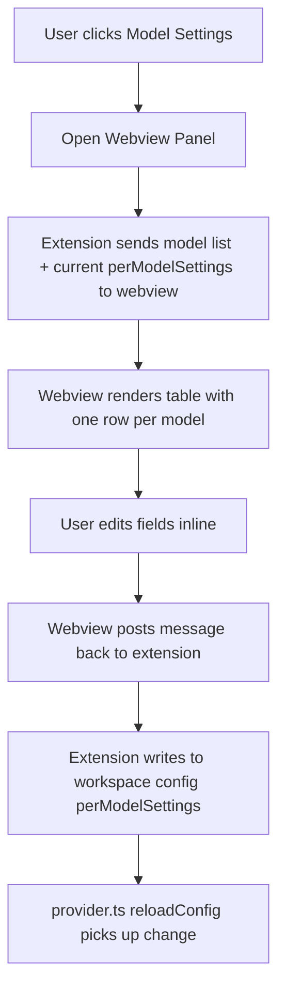

# Per-Model Settings Webview Panel — Design

## Goal

Provide a visual UI panel where users can configure per-model request parameters (reasoning_effort, temperature, max_tokens, etc.) instead of manually editing `settings.json`.

## Entry Points

1. **Status tooltip footer** — new link `$(list-unordered) Model Settings` next to existing Configure/Test links
2. **Command palette** — `GitHub Copilot LLM Gateway: Model Settings` (`github.copilot.llm-gateway.modelSettings`)
3. **package.json** — register new command in `contributes.commands`

## Data Flow



## Webview Layout

```
┌─────────────────────────────────────────────────────────┐
│  LLM Gateway — Model Settings                    [Save] │
├─────────────────────────────────────────────────────────┤
│  Model               │ reasoning │ temp │ max_tokens    │
│                       │ _effort   │      │              │
├───────────────────────┼───────────┼──────┼──────────────┤
│ claude-opus-4.7       │ [high ▾]  │ [0  ]│ [     ]      │
│ claude-sonnet-4.6     │ [medium▾] │ [0  ]│ [     ]      │
│ gpt-5.5               │ [medium▾] │ [0.3]│ [     ]      │
│ gpt-4o                │ [   ▾  ]  │ [   ]│ [8192 ]      │
│ ...                   │           │      │              │
├─────────────────────────────────────────────────────────┤
│  + Add custom parameter for all models: [key] [value]   │
│                                                         │
│  Empty fields use global defaults from extension config │
└─────────────────────────────────────────────────────────┘
```

### Per-model configurable fields

| Field | Input type | Notes |
|-------|-----------|-------|
| `reasoning_effort` | dropdown: empty/low/medium/high | OpenAI-style thinking effort |
| `temperature` | number input | 0-2 range, step 0.1 |
| `max_tokens` | number input | Override output token limit |
| Custom key/value | text inputs | Any extra param the server supports |

### Behavior

- **Empty fields** = no override, uses global `extraModelOptions` + `defaultMaxOutputTokens` etc.
- **Save** button writes the entire `perModelSettings` object to `github.copilot.llm-gateway.perModelSettings` in workspace settings.
- Changes take effect immediately (config change listener fires `reloadConfig`).
- Panel title: `LLM Gateway Model Settings`
- Panel uses VS Code toolkit CSS variables for native look.

## Files to Create/Modify

| File | Action | Purpose |
|------|--------|---------|
| `src/modelSettingsPanel.ts` | Create | Webview panel class with HTML renderer and message handling |
| `src/extension.ts` | Modify | Register `modelSettings` command, wire to panel |
| `package.json` | Modify | Add command declaration |
| `src/statusTooltip.ts` | Modify | Add Model Settings link to footer |

## Implementation Notes

- Use `vscode.workspace.getConfiguration().update()` to persist — no SecretStorage needed since these aren't sensitive.
- The webview HTML is self-contained (inline CSS + JS) — no external assets needed.
- Model list comes from `provider.getStatusSnapshot().models`.
- Use VS Code's `--vscode-*` CSS variables for theme-consistent styling.
- Webview `retainContextWhenHidden: true` so edits aren't lost when switching tabs.
